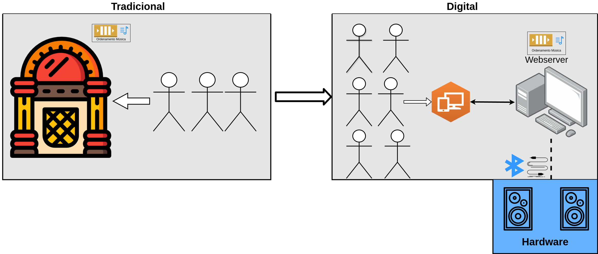

# Sons Encadeados

< LOGO APP >

## O que é ? 

Inspirado em <a href="https://pt.wikipedia.org/wiki/Jukebox">Jukebox</a>(criado no século XX), 
o projeto **Sons Encadeados** é um app híbrida em que o público selecionará músicas 
de forma online, distribuída e interativo. 
Em outras palavras, ele será um <u>*jukebox digital*</u> em que usuários poderá encontrar as músicas que deseja ouvir de forma ordenada.

## Qual foi o motivo da criação?

Mesmo tendo o processo tecnológica como dispositivos portáteis, redes sociais, IA Generativa e etc. 
Em tempos de **NOSTALGIA**, as pessoas querem resgatar 
devido em que alguns recursos tecnológicos legados valem a pena
ser reutilizados nos dias de hoje, dentre eles a jukebox. 
No entanto, possui algumas desvantagens ao utilizar o sistema legado, principalmente
por em que usuários possui o tempo de espera
e ser totalmente centralizado para realizar
operações da máquina .

Diante disso, foi solucionado em que o sistema poderia ser migrado
de maneira digitalizado através da integração streamings(ex: youtube)
e conectado ao aparelho de som.

### Modelagem negócio

Segue o modelo de negócio de como o novo projeto irá funcionar em relação ao legado. 

<i>Comparação do sistema entre <strong><u>Legado x Digital</u><strong>

## Repositórios

- [ms-sons-encadeados-api](https://github.com/gabriel-soares-dev/sons-encadeados-project/tree/master/ms-sons-encadeados-api)
- [sons-encadeados-ui](https://github.com/gabriel-soares-dev/sons-encadeados-project/tree/master/sons-encadeados-ui)